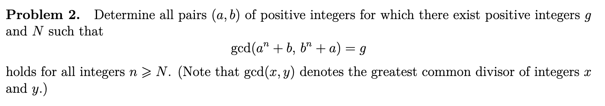

# Solving the 2024 IMO (well, atleast I’ll try)

## Problem 1

# 

*Solution*

$$
m\alpha - 1 < \lfloor{m\alpha}\rfloor \leq m\alpha \ \  m\in \mathbb{Z}^+\\ 
\implies \dfrac{n(n+1)}{2} \alpha - n < \sum_{m=1}^n \lfloor{m\alpha}\rfloor \leq \dfrac{n(n+1)}{2} \alpha \\ 
\text{For the required sum to be a factor of } n, \ \  \exists k \in \mathbb{Z}^+  \ \  \sum_{m=1}^n \lfloor{m\alpha}\rfloor = kn \\ 
\dfrac{n(n+1)}{2} \alpha - n < kn \leq \dfrac{n(n+1)}{2}\alpha \\
\text{Cancelling } n \text{ as it is positive.} \\  
\dfrac{(n+1)}{2} \alpha - 1 < k \leq \dfrac{(n+1)}{2}\alpha \\    
\text{Given that $\alpha$ is a real number.} \\ 
-- \\ 
\mathrm{Case 1:}  \dfrac{n+1}{2} \alpha > 0 \implies \alpha > 0 \\  
-- \\ 
\mathrm{Case 2:} \dfrac{2k}{n+1} \leq \alpha < \dfrac{2(k+1)}{n+1} \ \ \ \forall k \in \mathbb{Z}^+ \\  
$$

## Problem 2

*Solution*

$$
\text{There exists some symmetry between } a \text{ and } b. \\ 
\gcd(a^n + b, b^n + a) = g \implies (a^n + b) | g \  \& \ (b^n + a) | g  \\ 
\text{If } a^n \ \% \  g = c, \text{then } b \ \% \ g = g - c \quad \forall n \geq N \quad 0 \leq c \leq g-1\\ 
\text{Further, Consider the two cases where } n = N \ \& \ n = N+1 \\
a^N \ \% \ g = c \ \& \ a^{N+1} \ \% \ g = c, ...\forall n \geq N \\ 
\implies ac \mod g = c \\ 
ac = qg + c  \\ 
$$
