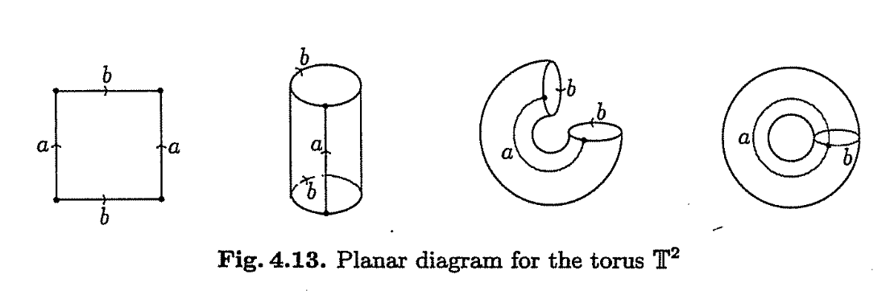
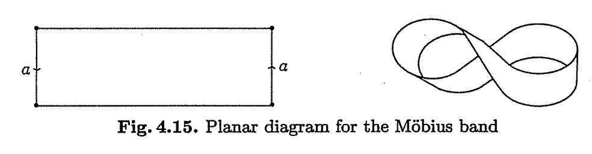
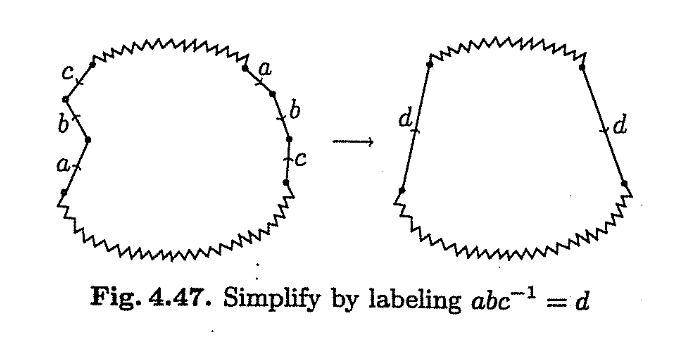

All roads lead to Rome. But I must say, this journey into topology was
embarked from a pavement. Without wasting much time on my kitschy yet
romantic exposition of how we got there, let's dive in into Topology. I
am mostly following the Introduction to Topology by Kinsey. Why? 'Cause
my advisor told so, that's why. I am listening to this slowed down
bollywood with added rain effects (idk it's soothing) while I do so:
[link](https://www.youtube.com/watch?v=IEEFSlkKR_U).

The textbook starts with a quintessential example of turning a doughnut
into a coffee cup. Wish I could also pass on all those extra calories.
Topology is essentially the study of special properties of surface that
are invariant to squishing, squeezing, bending, and stretching. But
don't break it, god forbid!

> Two objects are topologically identical if there is a continuous
> deformation from one to another. In that way, it could be considered
> ''rubber-sheet geometry" apparently. This topological equivalence is
> also referred to as being *homeomorphic*.

That being said, we start with the first chapter, the simpler of all,
the *Point-set topology*.

## Chapter 1: Point-set topology

The study of the most general possible object: a set of points. For now,
we will constrain to the real *n-space*, $\mathbb R^n$.

A *disc* is typically used to discuss a neighborhood, but this is a
misnomer. It essentially represents a $n-$dimensional sphere that is the
neighborhood defined in terms of the Euclidean distance.

The *interior*, *exterior*, and *boundary* or *limit* points are
determined depending on the nature of their neighborhood.

The *closure* $Cl(A)$ is the set of all limit points of $A$ and is a
closed set.

A function $f: X\to Y$ is a *homeomorphism* iff it is continuous,
invertible, and its inverse function $f^{-1}$ is also continuous. The
spaces $X$ and $Y$ are topologically equivalent.

Topological equivalence is an equivalence relation, meaning it's
symmetric, reflexive, and transitive.

A set of points is *compact* if every infinite sequence of points in $A$
has a limit point in $A$.

-   The real line is not compact since the sequence
    $\{1, 2, 3, 4, \cdots\}$ consists of points in $\mathbb R$ but has
    no limit point in $\mathbb R$. Furthermore, $(0, 1)$ is also not
    compact.

Intuitively and by *Heine-Borel* theorem, a compact set is both closed
and bounded.

Accordingly, a cube is compact.

Have gone through multiple chapters in the book. Mostly these chapters
were on point-set topology and connectedness, product spaces, and
quotient spaces. These are not my main focus but I acknowledge that some
kind of foundation on them is useful. With that said, I switch into the
chapter on *Surfaces*.

## Chapter 2: Surfaces

A topological complex could be constructed by glueing the similarly
labeled edges together while being cognizant of the edge directions. For
example, for glueing, both the edges should be in the same direction.

A cylinder can be constructed by glueing one set of opposite edges
together.

A torus can be constructed by gluing both the opposite edges of a
rectangle.

A disk with a zipper, i.e., both the semicircles having the same
direction, is topologically equivalent to a sphere's surface.

There are ofcourse, many different planar diagrams for any surface.

On the other hand, to represent a mobius strip, the opposite edges to be
glued in the rectangle should be pointing in the opposite directions so
that one of the edges have to be twisted so as to be glued to the other.
The mobius strip however, has only one side, in contrast to the
cylinder.

A *manifold* is a topological space such that every point has a
neighborhood topologically equivalent to a $n-$ dimensional open disk
with center $\mathbf{x}$ and radius $r$. A two-dimensional manifold is
often called a surface.

This implies manifolds are Hausdorff spaces.

In classifying the surfaces, the ability to "enclose a cavity" will turn
out to be a distinguishing feature.

Removing two discs from two tori and gluing them together to obtain a
2-handled torus. Notice that the planar polygon for an orientable
surface is a $4g$ sided polygon, given that $g$ is the genus.

While it might seem odd that for a homeomorphism, cutting is not
allowed, any cut can be repaired by gluing things back just the way they
were.

### Classification of surfaces

Every compact connected surface is homeomorphic to a sphere, a connected
sum of $n$ tori, or a connected sum of $n$ projective planes. The steps
involved in classifying the surface are as follows.

**Step 1: Build a planar model of the surface**

Since $S$ is a compact surface, there is a simplical complex on it with
finitely many triangles. Since $S$ is connected, its triangles can be
rearranged so that each triangle is glued to an earlier one. Then,
assemble them in the chosen order to form a polygon representing a
planar diagram of the surface.

A surface is connected iff a triangulation can be re-arranged in the
order $T_1, T_2, ..., T_n$ such that each $T_i$ has atleast one edge
common with $T_{i-1}$.

**Step 2: A shortcut**

A string of edges that occur twice in exactly the same order, taking
into account the directions of the edges, we can relabel to consider the
string as a single edge.

Note that the edges can occur in two forms: *opposing edges* or *twisted
pairs*.

**Step 3: Eliminate adjacent opposing pairs**

Adjacent opposing pairs can be eliminated by foldiing them in and giving
them edges together.

**Step 4: Eliminate all but one vertex**

**Step 5: Collecting twisted pairs**

A twisted pair of edges labeled $a$ may be made adjacent by cutting
along the dotted line and regluing along the original edge $a$.

**Step 6: Collecting pairs of opposing pairs**

If steps 1 through 5 have been performed, then any opposing pairs must
occur in pairs.

## Chapter 3: The Euler Characteristic

As the author quotes, ''the obviousness of a fact never stopped
mathematicians from proving it", this chapter focuses on showing how the
sphere, sum of tori, and connected sums of projective planes, are indeed
really different types shapes.

Of course, the surface can be classified by creating a mind meld of
cutting and pasting the surface until it is identifiable, or, perhaps,
cutting it open to form a complex, triangulating the complex, and going
through the process described above, to obtain an identifiable planar
diagram. The first method is, at best, unreliable, while the second
method is tedious.

Isn't it better if we can perhaps come up with a characteristic of the
surface that can indisputably differentiate between two surfaces. In
this chapter, a simple topological invariant is introduced for exactly
this purpose: *the euler characteristic*. This is the first step in the
algebraization of topology—finding something computable to describe the
shape of a space.

The information carried by the Euler's characteristic regarding the
surface is simply a number, but easy to compute. If one needs more
information regarding the surface, homology theory, although difficult
to compute, offers more explicit information regarding the shape of a
space.

A *graph*, $\Gamma$, is a connected 1-complex.

*Reminder:* In topology, a 1-complex (also known as a 1-dimensional
complex or a graph) is a topological space formed by a set of points
(0-cells or vertices) and line segments (1-cells or edges) connected by
those points, forming a fundamental building block for understanding
higher-dimensional spaces.

A *tree* is a graph with no cycles.

For any graph $\Gamma$, $\chi(\Gamma) = v - e$ is the euler
characteristic of $\Gamma$

Let $T$ be a tree. Then, $\chi(T)$ = 1.

Let $\Gamma$ be a graph with $n$ distinct cycles. Then,
$\chi(\Gamma) = 1 - n$.

> Note that adding a vertex in the middle of an edge does not change the
> euler characteristic.

### The euler characteristic of a sphere

First, we study how much information can be gotten from the euler
characteristic and then establish that it is a topological invariant.

**(Def)** Let $K$ be a complex. The euler characteristic of $K$ is
$\chi(K) = \#(0-cells) - \#(1-cells) + \#(2-cells) - \#(3-cells) \pm \cdots$

For 2-complexes, let $f = \#\{faces\}$, $e = \#\{edges\}$, and
$v = \#\{vertices\}$, then the euler characteristic must be written as:
$\chi(K) = v - e + f$.

Example: In a polygon with $n$ sides, the euler characteristic is
$\chi(K) = n - n + 1 = 1$.

Now for a sphere $\mathbb S^2$ , the planar diagram $K'$ has 1 face, 2
vertices, and 1 edges, and therefore has an euler characteristic of
$\chi(K') = 1 - 1 + 2 = 2$

There are many different complexes that can also represent this square.
Now is it possible to show that any of these complexes have the same
euler characteristic?

**(Theorem)** Any 2-complex, $K$, such that $|K|$ is topologically
equivalent to the sphere has a euler characteristic $\chi(K) = 2$.

*Proof*. First, we triangulate the surface into $K'$. The final remains
at $\chi(K') = 2$. First, we remove a triangle from the surface creating
a hole on the sphere. This becomes a $\chi - 1$ surface. It however
remains a 2-complex system. Now, start removing each triangle from the
surface. There are three cases when the triangle shares, an edge, two
edges, or one vertex with the boundary of the hold created. In all these
cases, the $\chi$ remains the same.

Finally, only a single triangular face $\chi(K'') = 1$ remains.

Since $\chi - 1 = 1$, $\chi = 2$.

### The euler characteristic and surfaces

Euler characteristic is usually computed by means of cell decomposition.
It is surprising that something so easy to compute should be a
topological invariant.

Here are the ways you can perform triangulation without changing the
euler characteristic.

-   Add an edge between two vertices of a polygon.

-   Add a vertex in the interior of the polygon and an edge from this
    vertex to a boundary vertex of the polygon.

-   Add a vertex in the interior of an edge.

Using these, we can try to perform the triangulation of a torus for
example.

## Chapter 4: Homology

The object of topology is the classification and description of the
shape of a space up to topological equivalence.

The method described above using the euler characteristic can still be
arduous and cannot differentiate the orientable or non-orientable nature
of the surfaces. For example it *fails to differentiate between a torus
and a klein bottle*, both of which have $\chi = 0$. Specifically, euler
characteristic remembers to glue the edges together but ignores the
direction of gluing. Homology respects these directions.

These gluing directions determine for example, that the gluing of
1-cells of a 2-complex determine whether the 2-cell forms a hollow
cavity as in the inside of a torus, or not, as in the Klein bottle.

THe algebraization of topology will be a sort of layered invariant,
called the homology groups, which try to express all this information.
