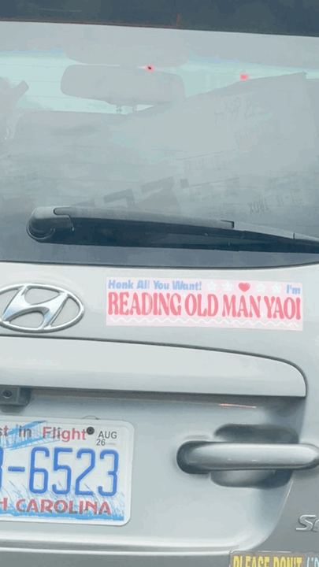
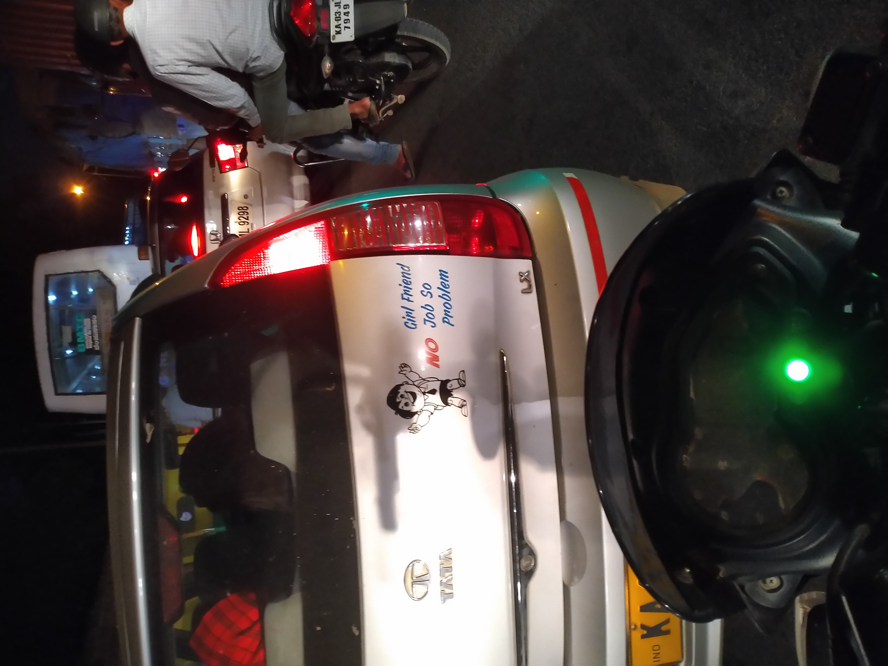
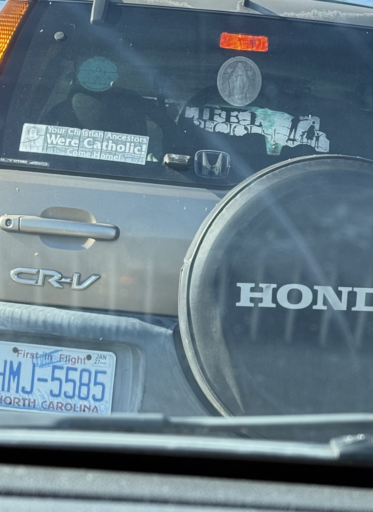
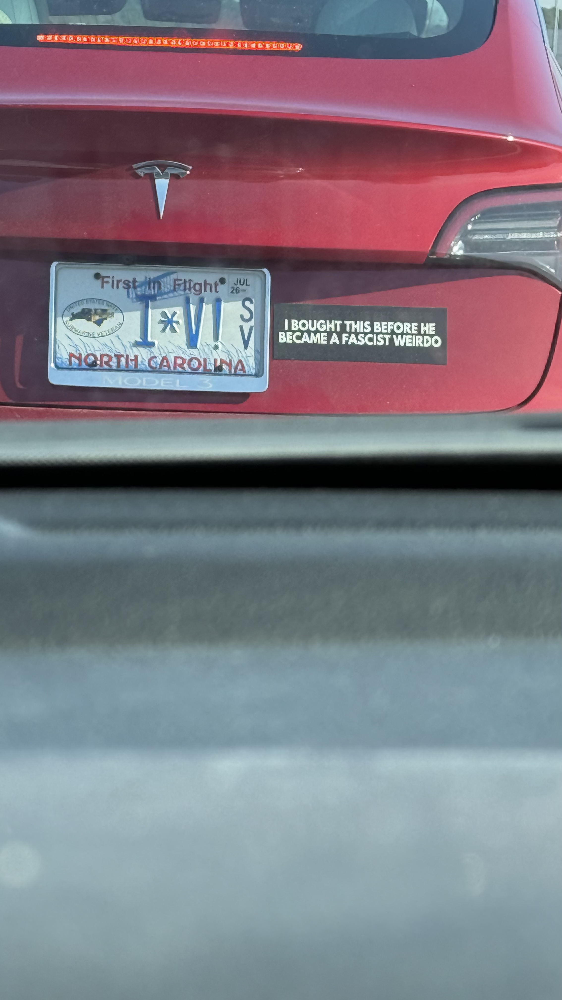
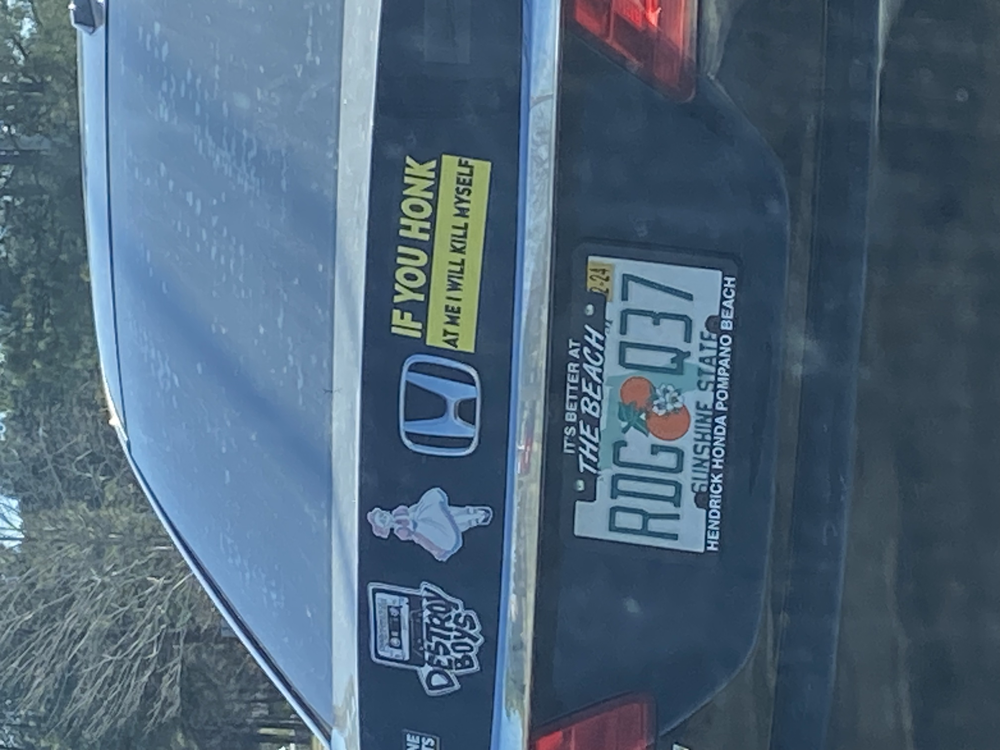
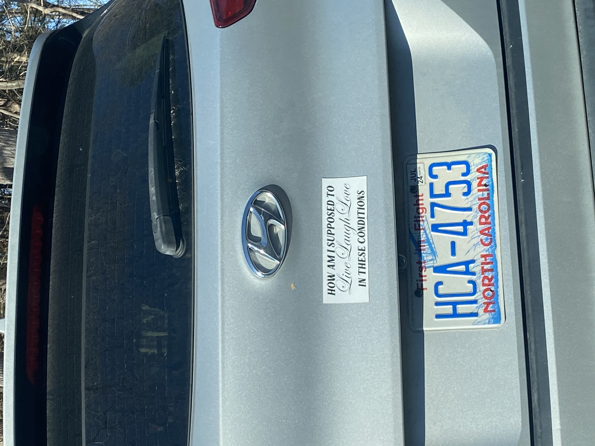
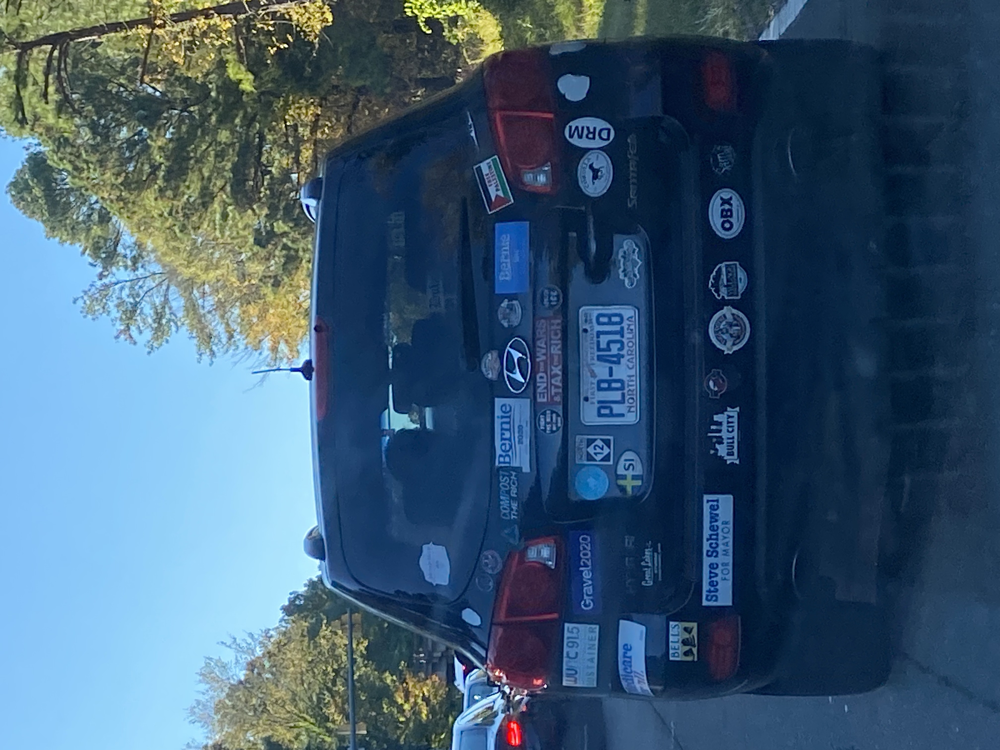
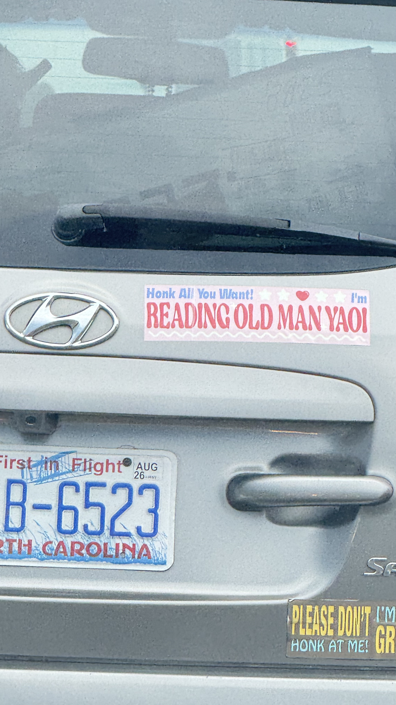
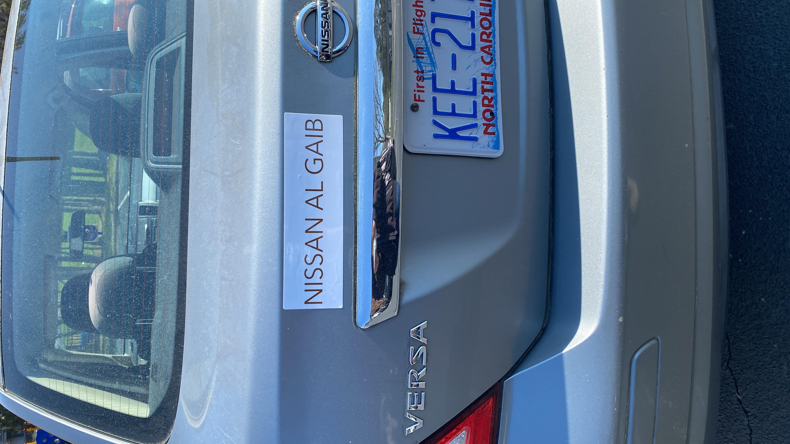
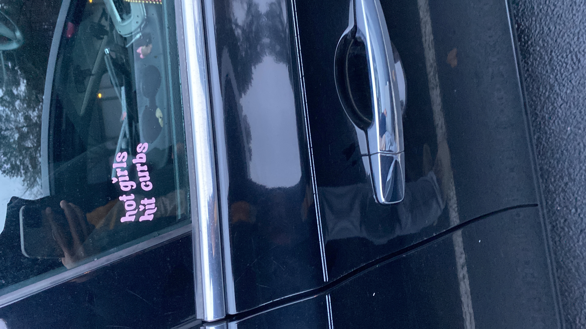

One of my favorite things about American roads is the bumper stickers.
They tickle me and make the drive interesting. Like someone is going out
of their way to entertain a fellow driver. I feel humanity in that act.
Especially the edgy ones. Here are some I captured over the years. Wink
wink, one of them is mine. Guess which and email me. Coffee guaranteed
if right. :)

[Edit](https://github.com/rajiv256/rajiv256.github.io/edit/main/_posts/2026-08-17-car-bumper-stickers.Rmd)
